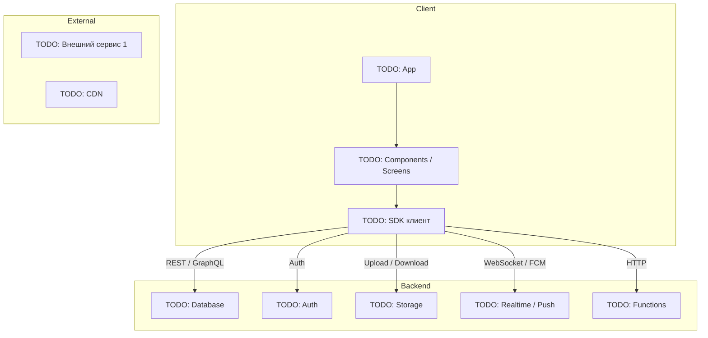

# Архитектура системы

## Обзор архитектуры

[TODO: 2-3 предложения — какой это тип приложения (mobile / web / desktop), какой подход (клиент-сервер, BaaS, микросервисы и т.д.), какая общая логика.]

**Стек технологий:**
- **Frontend:** [TODO: напр. Flutter / React Native / Next.js + TypeScript + Tailwind]
- **Backend:** [TODO: напр. Supabase (self-hosted или managed), Firebase, custom API]
- **Deploy:** [TODO: напр. Vercel (frontend), VPS (backend), Google Play / App Store]
- **Дизайн:** [TODO: Figma ссылка]

**Принципы:**
- [TODO: напр. Mobile-first адаптив]
- [TODO: напр. Row Level Security на уровне БД для авторизации]
- [TODO: напр. Минимальная сложность — BaaS вместо кастомного бэкенда]
- [TODO: ...]

## Диаграмма



## Клиент

**Платформы:**
- [TODO: iOS 14+ / Android 7+ / Web (Chrome, Safari, Firefox, Edge)]
- Адаптив: [TODO: брейкпоинты, см. DESIGN-SYSTEM.md]

**Ключевые библиотеки:**
- `[TODO: пакет]` — [TODO: для чего]
- `[TODO: ...]` — [TODO: ...]

**Структура проекта:**
```
[TODO: дерево папок и краткое описание каждой]
src/
├── app/            # [TODO]
├── components/     # [TODO]
├── lib/            # [TODO]
└── types/          # [TODO]
```

## Бэкенд

[TODO: Описание бэкенда. Если Supabase — какие сервисы используются. Если кастомный — язык, фреймворк, где хостится.]

**Компоненты:**
- **[TODO: Database]:** [TODO: какие основные сущности хранятся]
- **[TODO: Auth]:** [TODO: метод (email+password, OAuth, magic link)]
- **[TODO: Storage]:** [TODO: какие файлы и бакеты]
- **[TODO: Functions]:** [TODO: webhooks, cron, кастомная логика]
- **[TODO: Realtime]:** [TODO: что подписывается, зачем]

## Внешние сервисы

| Сервис | Назначение | Документация |
|--------|-----------|--------------|
| [TODO: напр. Vercel] | [TODO: хостинг] | [TODO: ссылка] |
| [TODO: ...] | [TODO: ...] | [TODO: ...] |

## Потоки данных

### [TODO: Сценарий 1 — например, загрузка основной страницы]
1. [TODO: действие пользователя]
2. [TODO: что делает клиент]
3. [TODO: что делает бэкенд]
4. [TODO: что возвращается]
5. [TODO: как рендерится]

### [TODO: Сценарий 2]
[TODO: ...]

## Безопасность

- **HTTPS:** [TODO: обязателен везде, сертификаты от X]
- **Аутентификация:** [TODO: JWT / session cookies / OAuth, хранение токенов]
- **Авторизация:** [TODO: RLS / middleware / role-based]
- **Шифрование:** [TODO: пароли через bcrypt, данные в transit TLS, шифрование at-rest]
- **Rate limiting:** [TODO: где и какие лимиты]
- **Secrets management:** [TODO: .env / secrets manager, какие переменные есть]
